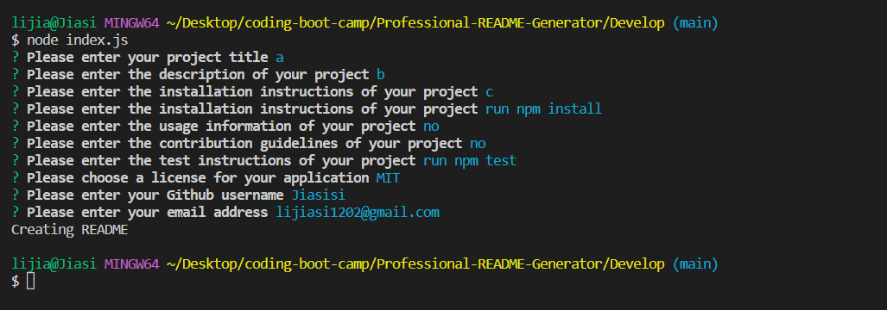
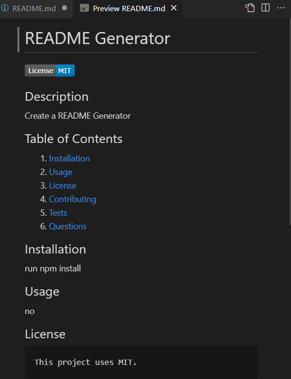
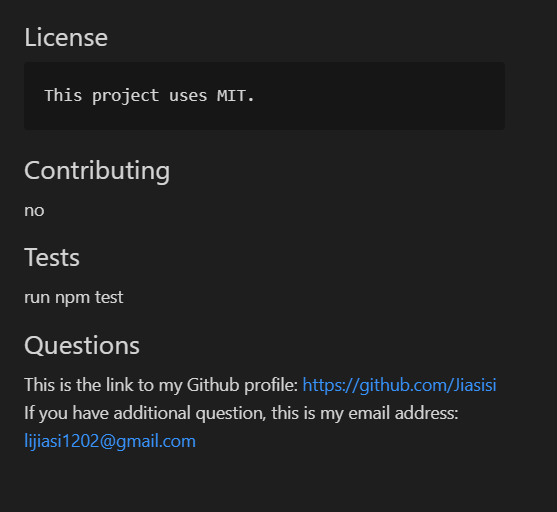

# 09 Node.js Challenge: Professional README Generator

## Description
In tthis challenge, I create a README Generator. 
When users run node index.js in Terminal, they need to answer some questions about this pproject, and according to these answers, this application will create a README file automatically bu using the answers which users entered. 

## Screenshot

## Links
Link of vedio: https://drive.google.com/file/d/1eB-_DAjPyCs9bFGW17NkuMBo1Fud-3H-/view?usp=sharing
Github repo: https://github.com/Jiasisi/Professional-README-Generator

